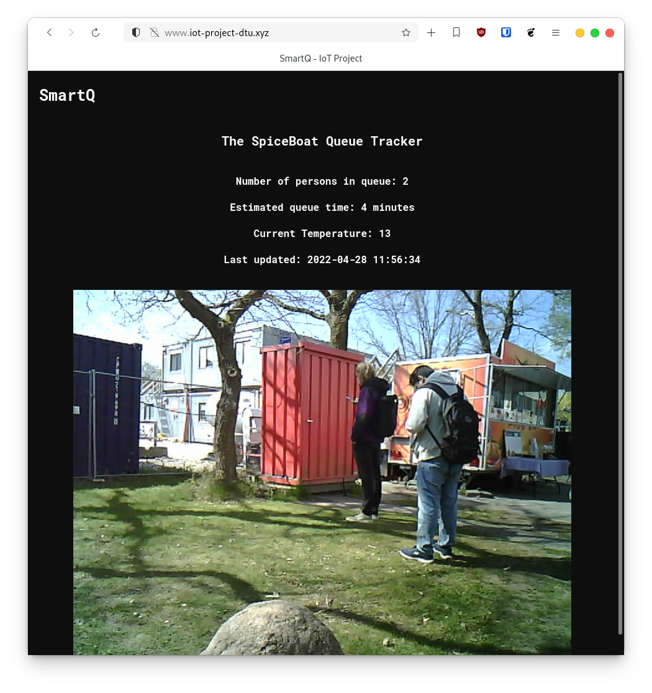

# IoT-Project
Exam Project in Internet of Things - application and infrastructure implementation (C34315)
Our project was queue tracker that counts individuals in a given photo and displays the estimated queue time and temperature on a webpage.
The functionality was build by combining the Google Vision ML API with custom build Flask website with REST API. The images for the queue tracker were taken by
the Arduino Uno microcontroller. The controller had an external camera and temperature sensor. The data was submitted to the Flask API websites through an http post request.

